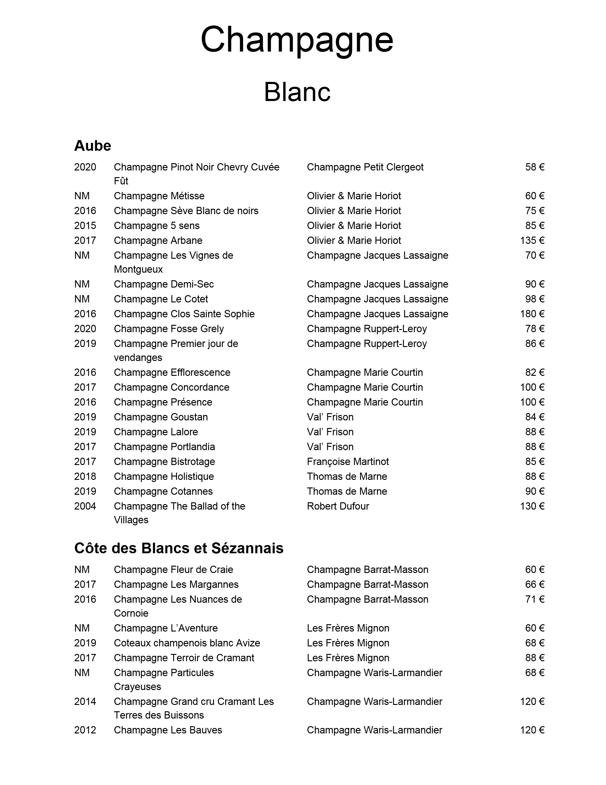

# Wine Cellar Menu Generator

This Python script automates the process of generating a well-formatted wine menu from a CSV file provided by the wine cellar owner. The script reads wine stock data from the CSV, formats it, and generates a professional PDF menu ready for printing or sharing.

## Project Description

The wine cellar manager has a stock management app that exports a CSV file containing wine data. However, the manager still manually creates the wine menu. This script automates the generation of a formatted PDF wine menu based on the CSV data, saving time and ensuring consistency.

The script takes the CSV filename as input and automatically generates a PDF with the wine list. It categorizes the wines and displays details like the name, type, and price in an organized layout.

## Features

- **CSV Input**: Reads wine stock data from a user-provided CSV file.
- **PDF Output**: Automatically generates a well-formatted PDF menu with wine information.
- **Categorization**: Sorts wines based on categories (e.g., red, white, sparkling) and presents them neatly.
- **Customizable**: Easily customizable for different formats, font styles, and layouts.

## Installation

### Prerequisites

1. Python 3.7+ installed on your machine.
2. Required Python libraries (listed below).

### Steps to Install:

1. Clone the repository:
   ```bash
   git clone https://github.com/jozyjozy/DataToMenu.git
   cd DataToMenu
then launch the script and fill the box with the csv name.

## Give it a look:


